# GPU Architecture & CUDA Notes

## Abbreviations

- CUDA: Computing Unified Device Architecture.

- GPGPU: general purpose GPU.

- JIT: Just-In-Time compilation.

- TPU: Tensor Processing Unit.

- SIMT: Single Instruction, Multiple Thread

- PTX: Parallel Thread Execution

- SaSS: Streaming ASSembly

- SM: Streaming Multiprocessors

- TMA: Tensor Memory Accelerator

- OpenCL: Open Computing Languages

- TFLOPS: Tera FLoating-point Operations Per Second

- HBM: High Bandwidth Memory

- SFU: Special function unit

## General Notes

- CUDA can now run on AMD GPUs using a ROCm (AMD platform) tool called Hipify, that migrates CUDA to AMD's HIP C++.

- CUDA uses the SIMT architecture: 1 single instruction will be executed by multiple threads on their respective data.

- The Host (CPU): Manages the application logic, memory allocation, and orchestrates data movement. It treats the GPU as a "coprocessor." (a small collection of very powerful cores)

- The Device (GPU): Executes the heavy math. It consists of thousands of small, efficient cores designed to do the same task on different pieces of data simultaneously. (a large collection of only modestly powerful cores)

- CPU DRAM is optimized for low latency, GPU DRAM is optimized for high throughput.

- PTX: a high-level virtual instruction set architecture (ISA) that serves as the assembly language for the NVIDIA CUDA GPU computing platform, enabling forward compatibility across different NVIDIA GPU architectures.

- SASS: the actual gpu ISA. CUDA toolkit or the gpu driver converts from PTX to SASS.

- data-parallelism: performing the same operation on different pieces/elements of data independently in parallel.
- task-parallelism: performing independent funtions/operations in parallel.

- kernel: the entry point for all code executed on the gpu, it's the function that every thread executes.

- `__global__`: called by host, runs on device, kernels are marked with this qualifier.
- `__device__`: called by device, runs on device.
- `__host__` (or no qualifier): normal host function, called by host, runs on host.

- when using both `__host__` and `__device__` qualifiers for the same function, they marks where the function "can" run, so the compiler compiles it (generated object code) to host/device arch in compile-time, but they don't specify where the function "will" run - it's a run-time decision.

- kernel invocation: the host calls a kernel using a triple chevron <<< >>>, giving number of blocks and number of threads per block, e.g. `someKernel<<<100,256>>>` launches 100 blocks of 256 threads.

- max number of threads per block is 1024.

- Thread: The smallest unit of execution.

- Block: A group of threads (up to 1,024) that can cooperate via shared memory and synchronize.

- Grid: A collection of blocks that execute the same function (the kernel).

- threads are executed in groups of 32, called a Warp. All 32 threads in a warp share a single Program Counter on the hardware level; they must execute the exact same instruction at the same time.

- in AMD arch, a warp is called a wavefront, and it consists of 64 threads.

- if a warp has less than 32 threads (e.g. a block has less than 32 threads, or number of threads is not multiple of 32), the hardware (scheduler) allocates a full warp of 32 threads, the inactive/idle threads still consume and waste cores and clock cycles. 

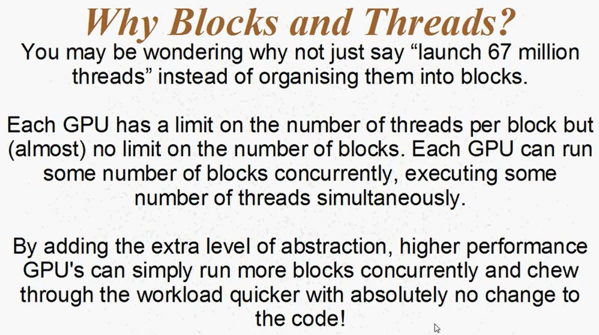

- each thread know the following info:
    - threadIdx: thread index in the block
    - blockIdx: block index in the grid
    - blockDim: number of threads in the block (in x,y,z directions)
    - gridDim: number of blocks in the grid (in x,y,z directions)

- The CPU and GPU have separate physical memory. You cannot simply de-reference a CPU pointer on a GPU. A typical CUDA program follows this workflow:

    1. Allocate memory on the GPU (`cudaMalloc`).

    2. Copy data from CPU RAM to GPU VRAM - global memory (`cudaMemcpy` with `HostToDevice`).

    3. Launch the Kernel (the GPU function).

    4. Copy results back to CPU RAM (`cudaMemcpy` with `DeviceToHost`).

    5. Free GPU memory (`cudaFree`).

- Modern CUDA also supports Unified Memory (`cudaMallocManaged`), which creates a single pointer accessible by both CPU and GPU, handling the migration automatically behind the scenes, replacing the manual copy from ram to vram and vice versa. this technique might be slower than manual control as it uses page faults (Individual 4KB pages move on-demand).

- When you then launch a kernel that uses that pointer, the gpu realizes it doesn't have the data, triggers a "page fault" and the driver automatically copies that page from RAM to VRAM over the PCIe bus, but u can use async "Prefetching"; this tells the gpu to start moving the data before the kernel starts, so it doesn't have to wait for those slow page faults.

```
// Manually "push" data to the GPU to avoid lazy loading
cudaMemPrefetchAsync(ptr, size, deviceID, stream);
kernel<<<...>>>(ptr);
```

- Performance Tip: ensure that the operations in the kernel are not "expensive" when performed by the GPU, for example, the modulo operator % is expensive, so u should replace it with a simpler operation. Generally speaking, operations other than add/subtract/multiply are relatively expensive and takes many clock cycles to be performed. 

### Branch divergence
- it occurs when threads within that same warp encounter a conditional statement (like `if`) and some evaluate to `true` while others evaluate to `false`, leading to threads being executed in serial. this happens as the warp has 1 program counter, so its threads can not be in 2 places at once, so the it masks the active threads at each step.

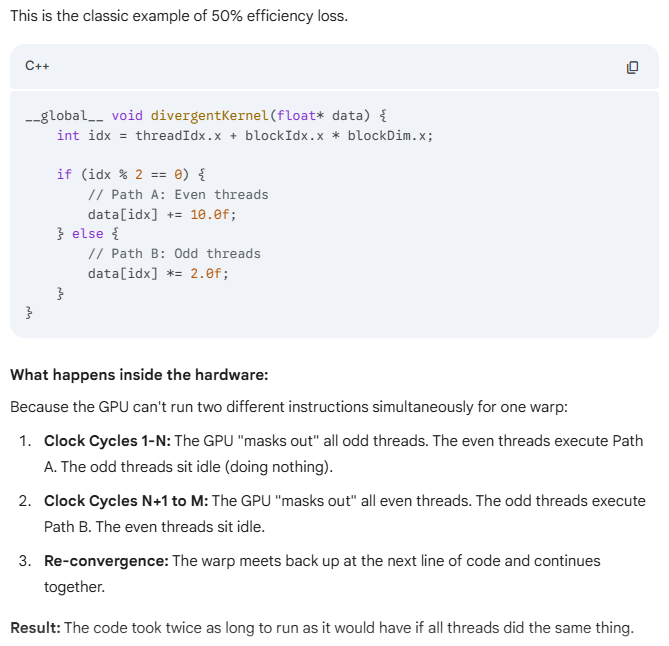

- so if we have branches similar to the following, all threads will execute A, some threads execute B (and threads that go in path F will stay still). threads that in B path will also be serialized; threads exectue C (path D threads are idle), then execute D (path C threads are idle), etc. the threads serialization is illustrated in the following diagram.

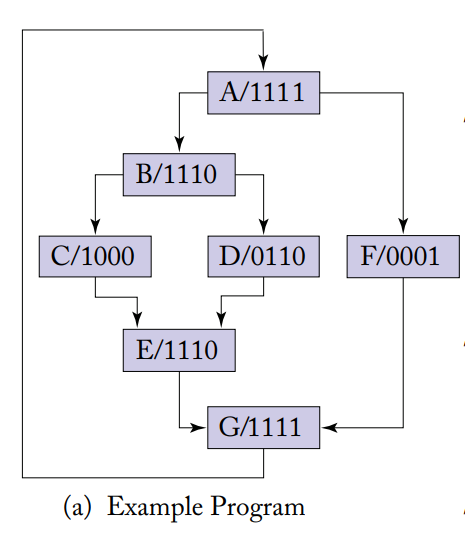
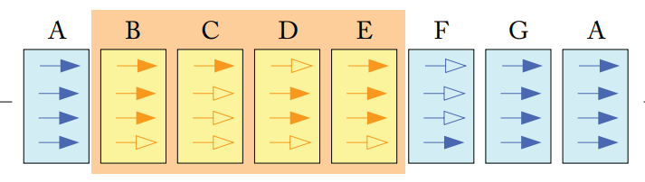

- reconvergence point: location in the program where threads diverge and continue executing the kernel (e.g. points E and G in the prev diagram). 

- another example :D

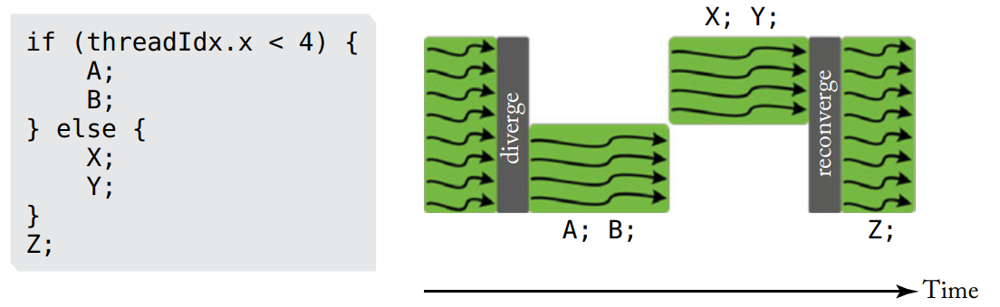

### Tiling technique (shared memory blocking)
- threads collaboratively copy small chunck of data (called Tile) from the global mem to the shared mem so they access them faster instead of accessing the global memory. this technique results in more than 10x faster processing.

- TMA: it's a hardware unit that moves blocks of data between Global and Shared memory asynchronously without using SM instructions.

- CUDA v13.1 release (December 2025), introduced CUDA Tile official implementation in Python (cuTile).

### Execution

- GPU is a collection of SMs. Each SM is like a hardware unit with its own set of cores, registers, and a special high-speed Shared Memory (L1-like speed). \
When you launch a Block of threads, that entire block is assigned to one SM. It stays there until it finishes.\
One SM can handle multiple blocks at once if it has enough resources (registers and memory), there is a limit on the total number of blocks that can be simultaneously executing in a CUDA device.\
The scheduler assigns new blocks to SMs when previously assigned blocks complete execution.

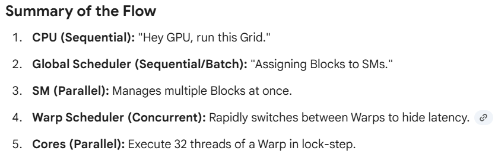

- the GigaThread Engine (Hardware Block Scheduler, or the Global Scheduler) is a hardware unit that assigns blocks to the SMs.

- If all 32 threads in a Warp are waiting for a memory read from VRAM, that Warp is "stalled." The SM will ignore it and work on other Warps. This is why we need many Warps—to keep the hardware busy while others are waiting in a sequential line for their data.

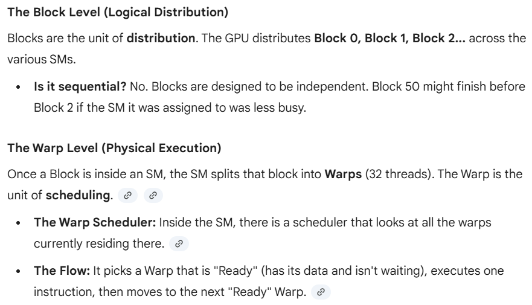

- If 1,000 threads all try to `atomicAdd` to the exact same memory address at the same time, the hardware serializes them. They literally line up and update the value one-by-one. This is a "sequential" part of an otherwise parallel program and it is a major performance bottleneck.


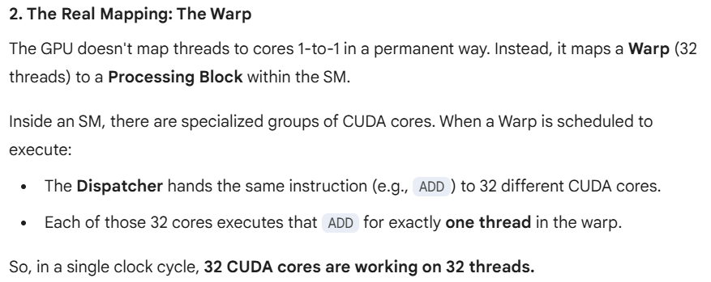

- `__syncthreds`: a command that offers a block-wide barrier, no thread in a block will go past this command until all threads of the block have reached it.\
in the following code, the happy path is each thread reads "i" with the latest value (e.g. thread 0 reads 0 and writes 1, thread 1 reads 1 and writes 2, etc..), but also multiple threads can read "i" with the same value (threads 0, 1 and 2 read 0, then all of them write 1, instead of 3). this is called "Read-Modify-Write" race. use `atomicAdd`.
```
__shared__ int i;
i = 0;
i++;
```

- `clock()` : return a clock-cycle counter value, the counter is per-multiprocessor (SM), meaning it's a local timer, not a globally synchronized one across the entire GPU. This is a crucial distinction, as different thread blocks running on different SMs might report different elapsed counts for the same code due to variations in execution.

## Hide Latency
- If a Warp requests data from the slow Global Memory, it has to wait 500 cycles. Instead of the SM sitting idle, the SM __instantly__ switches to a different Warp that is ready to do math. By the time that second Warp finishes, the first Warp's data has arrived.

- To "hide" the latency of global memory, you need many more threads than you have cores. This is why we launch millions of threads even if we only have 5,000 cores.

## GPU Memory

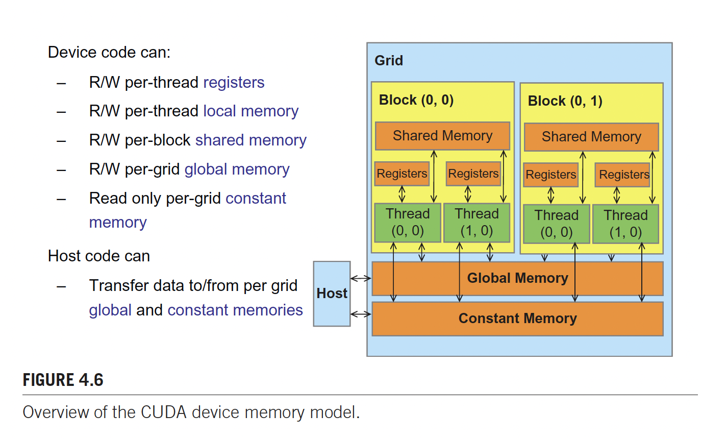

- Registers: 
    - per thread, 
    - the fastest

- Shared Mem: 
    - Shared by all threads within the same Block, 
    - Very fast (~100x faster than Global memory),
    - used for comm. between threads.
    - in AMD arch, it's called local data store.
    - organized into 32 banks.
    - also broken into words (4 bytes), successive words belong to successive banks (e.g. word 0 belongs to bank 0, word 1 belongs to bank 1, etc..), until word 32 which belongs to bank 0.
    - reads 1 word at a clock cycle, even if 1 byte is requested, the whole word is read. if a misaligned word is read (lower and upper halves are in different banks), then you need 2 bank requests.

- Global Mem (VRAM):
    - Accessible by all threads in all blocks + the CPU (Host).
    - Slow (High latency: 400–800 clock cycles).
    - This is where the bulk of your data lives (the arrays you `cudaMalloc`).

- Bank: slice of shared mem with 4 bytes width (32 bits).

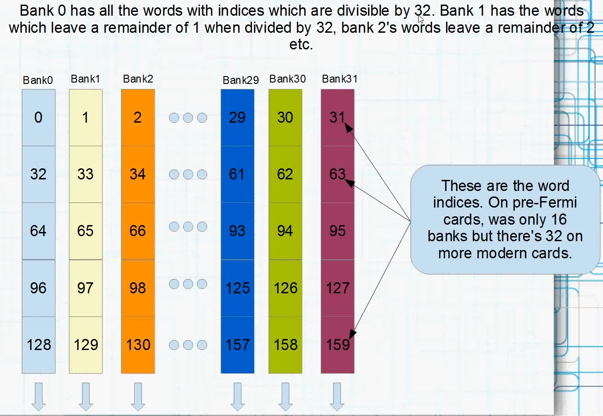

- Global mem L1 cache is the shared memory? physically yes, logically no.\
programmers can set size of shared memory, at compile-time and runtime:

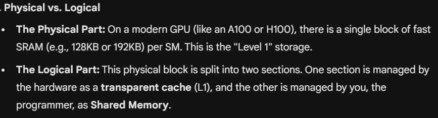

- Thread/Warp Request $\rightarrow$ Registers $\rightarrow$ L1 (SM-local) $\rightarrow$ L2 (Device-wide) $\rightarrow$ DRAM (Global Memory).\
Miss at any level triggers a request to the level below it.\
Hit at any level returns the data immediately and stops the search.

- register spilling: occurs when a thread tries to use more variables than the available hardware registers can hold, so the compiler "spills" the extra data into Local Memory (resides in Global Memory). what's new in CUDA 12: NVIDIA recently introduced a feature called __Shared Memory Register Spilling__, this allows the compiler to spill data into unused Shared Memory instead of Local Memory, which is much faster.

- if multiple threads in a warp access (read) the exact same address (the same value) within a bank, or if they access completely different banks, there is zero performance penalty, but: 

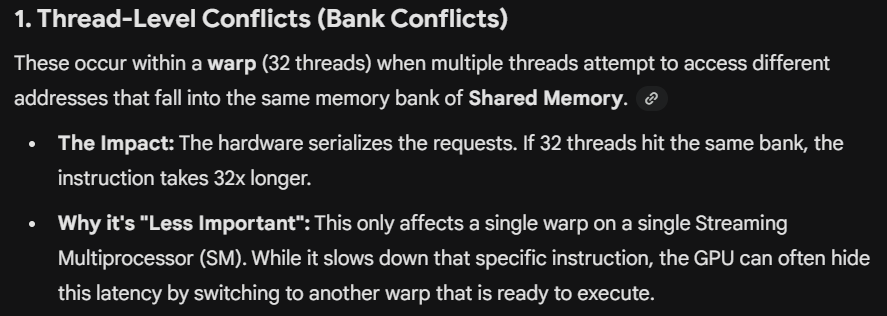

- Broadcast: a hardware mechanism that allows multiple threads in a warp to access (read) the exact same address (the same value) within the same bank with no performance penalty.

- Thread Block Clusters (introduced in Hopper), allows blocks to communicate with each other across different SMs, breaking the old "blocks are independent" rule slightly for performance.

- Distributed Shared Memory (DSMEM): This is the magic behind Thread Block Clusters. It allows a thread in Block A to directly read/write the Shared Memory of Block B (if they are in the same cluster), which was previously impossible.

### Memory Coalescing
- it's a hardware optimization technique, happens when consecutive threads (in the same warp) access consecutive global memory addresses. When this happens, the hardware combines (coalesces) these individual memory-access requests into a single memory transaction (read operation), significantly increasing throughput. this is faster than reading strided or random memory addresses.

- in matrix maltiplication for example, the matrix rows and cols are stored in 1 long consecutive physical memory addresses (flat memory), so when the threads of a warp are accessing a row, they access consecutive memory addresses, hopefully on 1 read operation, but when they access a col; where its addresses are strided, this might take more read operations (depending on matrix size) which results in more time.\
one optimization is to transpose the cols to be physically aligned/consecutive in the memory, or you can transpose the rows to make the multiplication slower :D


### Padding Trick
- in the following example, the struct has 4 floats (16 bytes), so thread 0 accesses shared[0].x (bank 0), .., thread 8 accesses shared[8].x which is 8*4 = 32 bytes away, meaning that it accesses bank 0 again, at the same time Thread 0 is hitting it. This causes an 8-way __bank conflict__ across the warp, forcing the hardware to serialize the requests and drastically increasing the cycle count (e.g. 11 clock cycles).

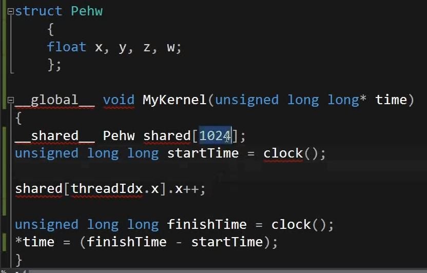

- adding padding, making the struct size 20 bytes (not multiple of 32), then thread 0 hits bank 0, thread 1 hits bank 5, .., thread 7 hits bank 7*5=35 % 32= 3, then the access pattern "rotates" through the banks without any two threads in the same warp hitting the same bank simultaneously, resulting in less time (e.g. 4 clock cycles).

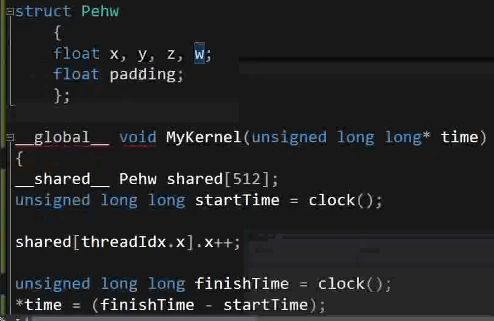

### Matrix multiplication with shared memory tiling optimization

- We break the $N \times N$ matrix into smaller sub-matrices (tiles) of size TILE_WIDTH $\times$ TILE_WIDTH, and TILE_WIDTH must match your `blockDim`. If your block is $16 \times 16$ threads, your tile should be $16 \times 16$ elements (as each thread will work on a single element).

- In a standard matrix multiplication, the dot product loop runs from 0 to $N$. In the tiled version, we don't look at the whole row/column at once. Instead, we "sweep" across the matrices in the tiles.

- Collaborative Loading: we iterate on the tiles, and each thread in a block is responsible for loading exactly one element from Global Memory into a Shared Memory array.

- Barrier Synchronization (first `__syncthreads`): We pause all threads in the block until the entire tile is loaded (every thread in the block has finished writing its element to Shared Memory), this prevents "race conditions" where a thread tries to calculate before the data exists.

- Compute Partial Dot-Product: Each thread performs multiplications using the data in the Shared Memory (tiles). Since Shared Memory is near-instant, this is significantly faster than the naive approach.

- Accumulate and Shift: We repeat the process for the next tile along the row of $A$ and column of $B$ until the full dot product is calculated.

- The second sync: Wait for all threads to finish computing before loading next tile, if we didn't wait, some fast threads might start overwriting the shared memory with the next tile's data while slower threads are still using the current tile's data.

- Boundary Protection: We include if statements to ensure that if the matrix size $N$ isn't a perfect multiple of the tile size, threads don't attempt to read or write out-of-bounds memory.

- Write result back to Global Memory.

- execution visualization: https://youtu.be/ccHyFnEZt7M?si=URNIv9GtnHwP2u9u

### More-elements-per-thread trick

- usually we implement the kernel so that each thread should process/work on 1 element of data. what if we let 1 thread process 4 elements of data? In sum reduction (sum all elements), this trick can be used to parallelize the execution.

- the following image shows how can 1 thread process 4 elements of data, and how this affects the performance.

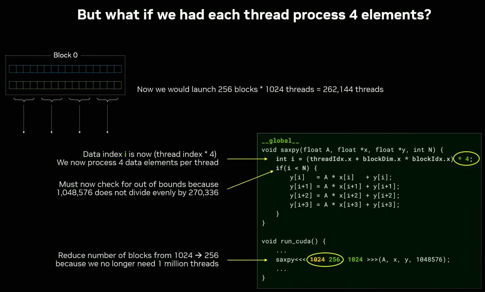
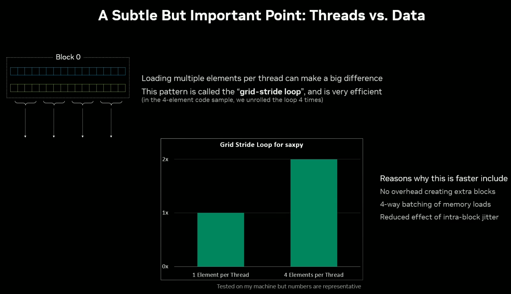

---

- nice note from NVidia GTC 2025 about using frameworks, libs and hard-coded kernels. 

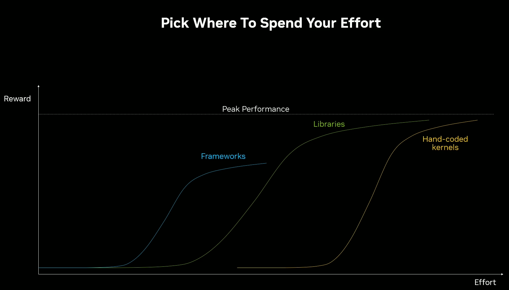

## Quotes from Books

- Why don't we optimize GPUs for low latency as CPUs?

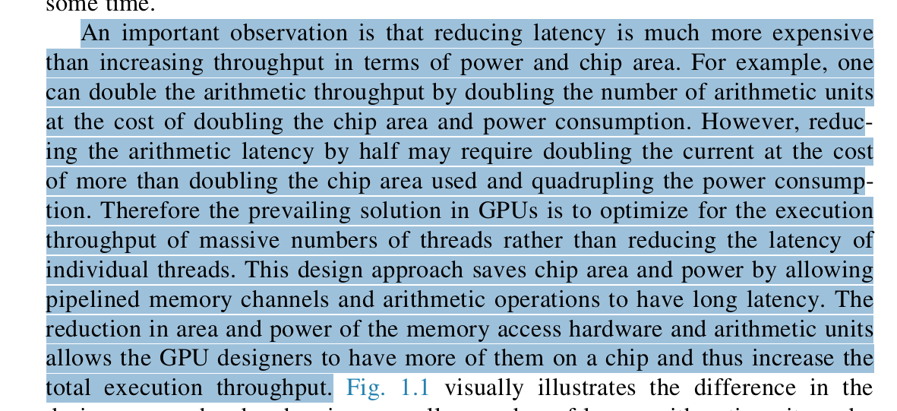

- GPGPU before CUDA needed to use the graphics interfaces.

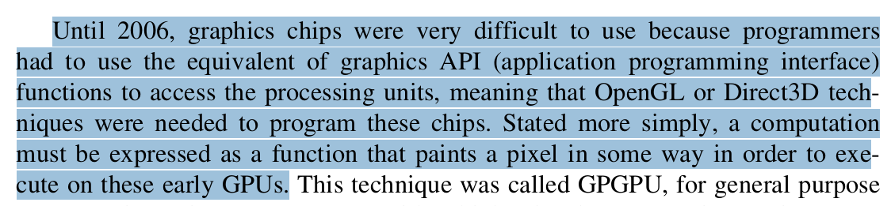 

- incorrect use of barrier sync

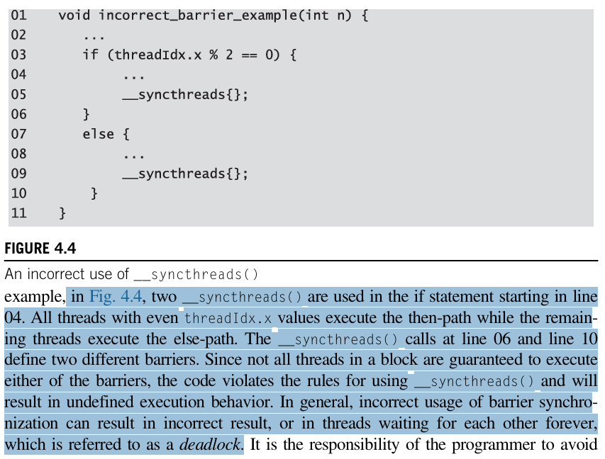

## Open Topics
- MPI
- CUDA Python
- Roofline analysis/model
- Profiling tools
- CUDA libs (e.g. cuBLAS, cuFFT)

## Study Resources:

- CUDA Tutorials by Creel: https://youtube.com/playlist?list=PLKK11Ligqititws0ZOoGk3SW-TZCar4dK&si=KdHO4Jruy8Rcp1Iv

- Modern CUDA C++ Programming Class by NVIDIA: https://youtube.com/playlist?list=PL5B692fm6--vWLhYPqLcEu6RF3hXjEyJr&si=1ulkrfetzJ0689M4

- "nvidia_cuda_cpp_tutorial__r4.pdf" from previous playlist

- Fundamentals of GPU Architecture by Nick: https://youtube.com/playlist?list=PLxNPSjHT5qvscDTMaIAY9boOOXAJAS7y4&si=mFpQOxEMYDXZxokL

- Book: General-Purpose Graphics Processor Architecture.

- CUDA Crash Course: https://youtube.com/playlist?list=PLxNPSjHT5qvtYRVdNN1yDcdSl39uHV_sU&si=zkeouRfnLDSY4ddY

- GTC 2025 Talk: https://youtu.be/6o_Wme-FdCU?si=hkzsuOugYGRGykF4