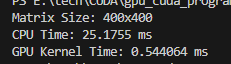
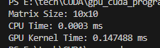
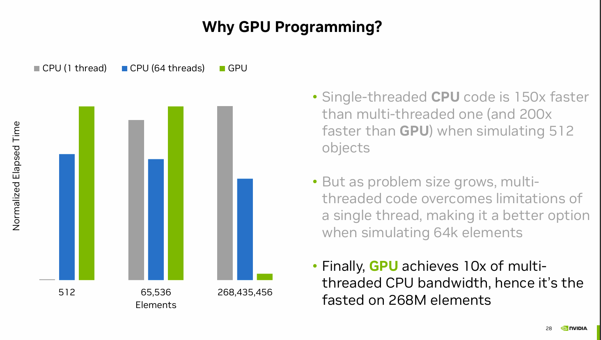

## Tutorial 2

### Quick revision on tutorial 1
- gpu is optimized for "embarrassingly parallel" processing.

### When to use CPU instead of GPU for processing
- if the data size is not massive! CPU might be way faster with limited input size

- if the processing is REALLY sequential and hard to parallelize (e.g. DFS vs mat mul)
- note that we use both, not either-or. CPU handles the application sequential processing and GPU handles the numerically intensive processing.

### Can we optimize GPUs for minimum latency to be even more powerful?
- latency is a function of freq
- higher freq, minimum latency
- increasing the freq -> increased power limit
- keep optimizing for throughput.

### What is CUDA
- Computing Unified Device Architecture
- parallel computing platform with tens of SDKs, libraries, profiling and debugging tools, etc..
- programming model: a structured way for 
    - communicating/programming GPUs,
    - running code on different processors (cpu and gpu).
    - specific arch for how data is organized
    - hierarchy of execution.
- note that CUDA is a platform and a programming model, not just a tool or a set of APIs.

### Hello CUDA code example
- why we have 3d Dim and indeces?
- number of threads per block should be multiple of 32 (hardware effeciency) 
- why is there an index validation condition in the kernel?
