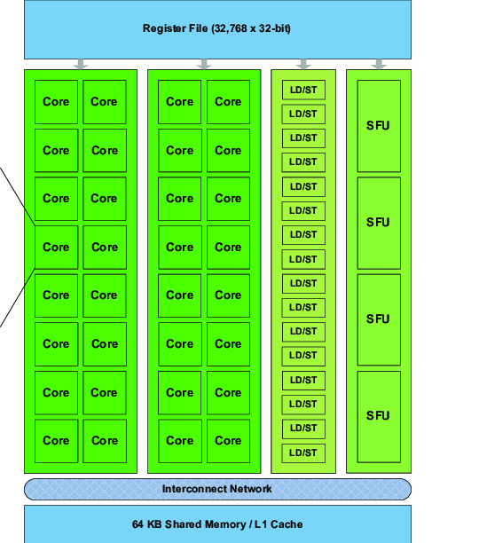
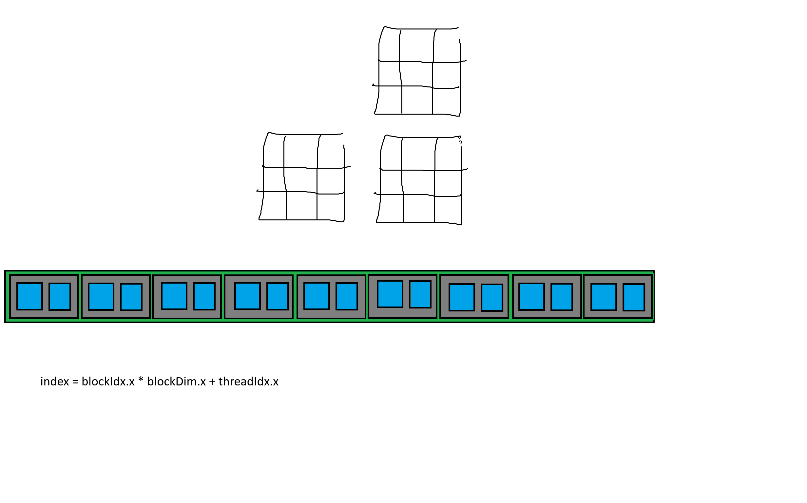
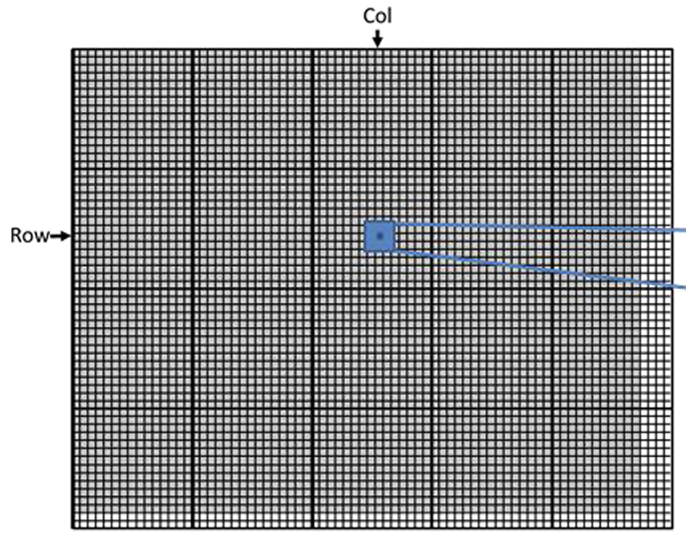

## Tutorial 3

### Launching the GPU kernel & GPU Hierarchy
- cpu launches the kernel with n blocks and m threads per block
    - thread is the smallest unit of execution.

- on launch, the gpu creates a grid, the grid contains n blocks, each block contains m threads
    - __to be discussed:__ why the number of threads per block should be a multiple of 32?

- the hardware block Scheduler (GigaThread Engine) assigns blocks (sw hierarchy component) to SMs; an SM (streaming multiprocessor) is a hardware unit with its own set of cores, registers and shared mem.
    - an SM can handle multiple blocks
    - if SM is streaming multiprocessor, then what is the processor? 
    - SMs don't take same number of blocks (resource usage, depends on distribution algo)
    - __to be discussed:__ how do a limited number of SMs handle undefined/unlimited number of blocks/threads? 
    - why does the scheduler assign the full block to one SM? (not half of a block is assigned to one SM, the other half is assigned to other SM)

- 

- 

- now the hierarchy is organized, and threads are ready for kernel execution

- before we get to the execution of threads on cores
    - what is the diff between a thread and a core?
    

- lets start the execution

- Warp, threads start and finish together as they have same PC

- independent execution of blocks -> good design for scalability -> 400 blocks can be 10x40 then 40x10. 

- sw logical hierarchy vs hw units?
    - grid, blocks, threads
    - gpu, gigathread + SMs, cores

- indexing the threads
    - 
    - grids and blocks can be 1D, 2D or 3D, why?
    - blockIdx
    - threadIdx
    - why do we have index validation in the kernel?
     

